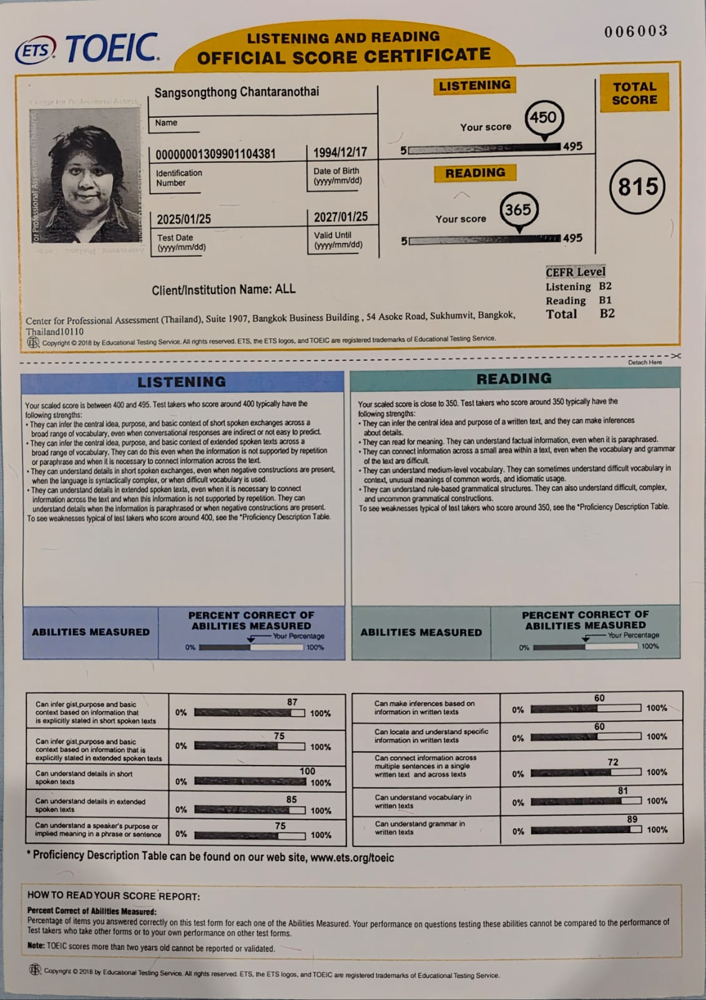
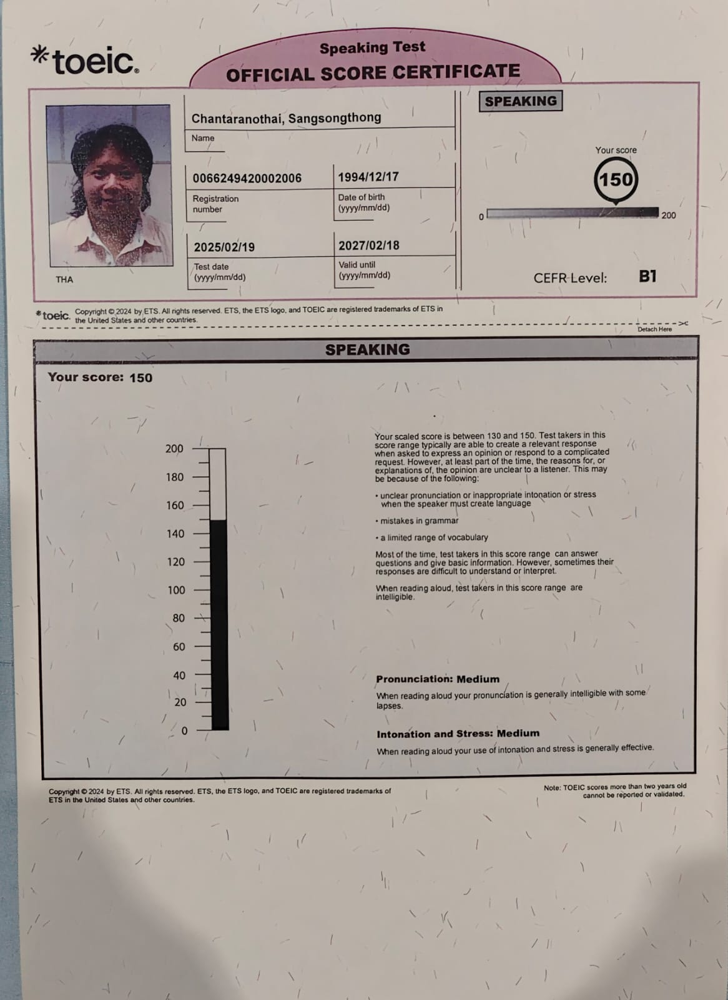
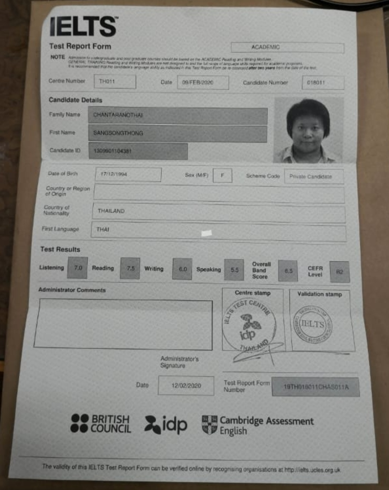
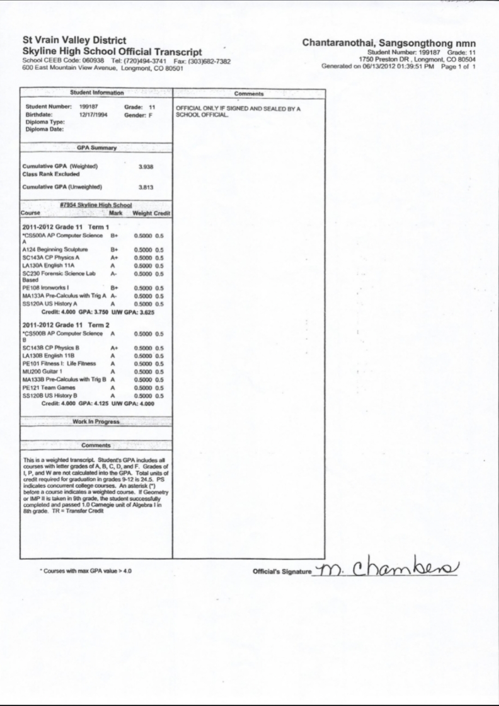

# My Languages Skills

This repository documents the language and cross-cultural communication skills that support my professional work. Alongside technical ability, I view language proficiency as an essential tool for collaborating with international teams, adapting to new environments, and building long-term career opportunities across different regions.

## Thai - Native

Native speaker - no certification required

## English

### TOEIC (2025 - 2027)

**TOEIC (Jan–Feb 2025):** Writing C1 · Listening B2 · Reading B1 · Speaking B1

### IELTS Academic (Expired — historical reference)

+ Date: February 2020
+ Overall Band Score: 6.5 (CEFR B2)
+ Listening: 7.0 | Reading: 7.5 | Writing: 6.0 | Speaking: 5.5

### Exchange Student In Longmont, CO, USA Transcript

**U.S. exchange year** — Skyline High School, Colorado (2011–2012)

## Romanian (In progress)

Duolingo A1

## Turkish (In progress)

Turkish Language course A1 (Cankaya Egitim Merkezi)

*Note: Due to some personal circumstances, I had to discontinue the course, but the learning material is still with me so I will continue to learn it on my own until a new circumstance arises.*

## Other Languages (Russian, Spanish, French, Italian, etc.)

Willing to learn if the opportunity arises through work or relocation.

## Summary

| Language | Level | Status |
| --- | --- | --- |
| Thai | Native | --- |
| English | B2-C1 | TOEIC valid 2025-2027 |
| Romanian | A1 | In progress (Duolingo) |
| Turkish | A1 | In progress (Cankaya Egitim Merkezi) |
