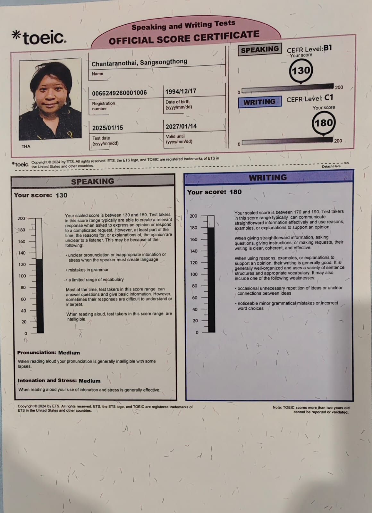

# My Languages Skills

## Thai - Native

Native speaker - no certification required

## English

### TOEIC (2025 - 2027)

### IELTS (Old reference)

Will insert the photo later

Expired - included as proof of prior attainment

### Exchange Student In Longmont, CO, USA Transcript

## Romanian (In progress)

Duolingo A1

## Turkish (In progress)

Turkish Language course A1 (Cankaya Egitim Merkezi)

*Note: Due to some personal circumstances, I had to discontinue the course, but the learning material is still with me so I will continue to learn it on my own until a new circumstance arises.*

## Summary

| Language | Level | Status |
| --- | --- | --- |
| Thai | Native | --- |
| English | B2-C1 | TOEIC valid 2025-2027 |
| Romanian | A1 | In progress (Duolingo) |
| Turkish | A1 | In progress (Cankaya Egitim Merkezi) |
