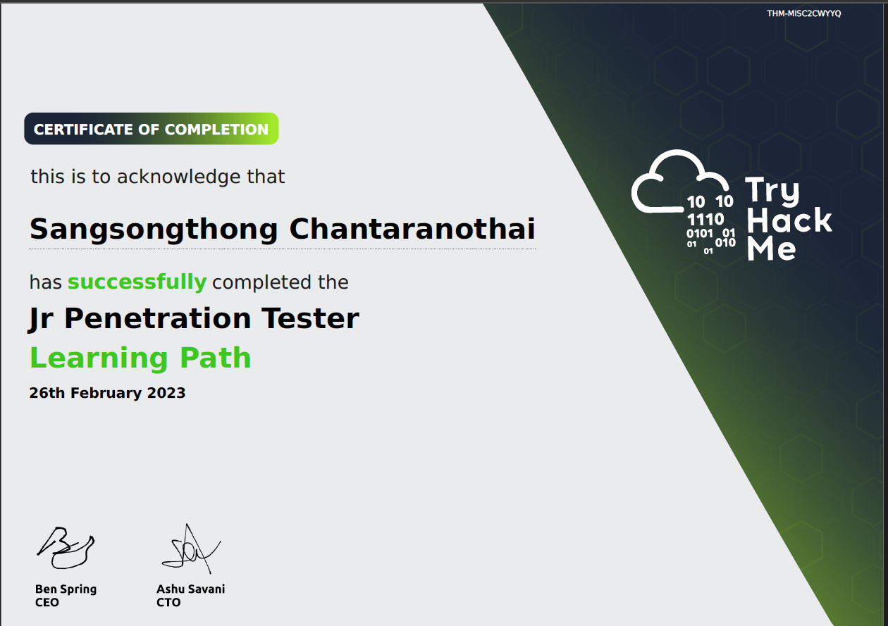

# Hi. I'm Sangsongthong Chantaranothai.

**Penetration Tester | SOC Analyst | CEO & Founder of Hexterika Cyber Lab**

A dedicated cybersecurity professional with a strong focus on penetration testing, security operations, and digital forensics. As the CEO and primary consultant of my start-up, Hexterika Cyber Lab, I offer cybersecurity services on Fiverr while continuing to build my skills and business. I also actively engage in Capture The Flag (CTF) challenges on the TryHackMe platform and run a virtual home lab to deepen my expertise.

### Degree:

- Bachelor of Sport Science

### Certificates:

- CompTIA Security+ ce 
    - [CompTIA Security+ ce](https://www.credly.com/badges/b856b0d7-bb20-466c-8981-b7744f8bb64f/public_url)
    - 
- Certified in Cybersecurity (CC) by ISC2
    - [CC](https://www.credly.com/badges/2219a41c-2094-41a5-a530-28cf093c2c29/public_url)
    - 
- Jr Penetration Tester learning path completion certificate by TryHackMe
    - 

### Cybersecurity Skills

- **Penetration Testing & Ethical Hacking**
    - Web Application Penetration Testing
    - Active Directory Penetration Testing
    - Internal Network Penetration Testing
- **Security Operations & Incident Response**
    - Log analysis and security monitoring.
    - Incident investigation and response

### CTF & Home Lab Experience

- **TryHackMe CTF Platform**
    - Actively participating in CTF challenges on the TryHackMe platform.
    - Sharing walkthroughs of rooms I’ve completed on GitHub to document and showcase my skills.
    - Ongoing learning with a focus on penetration testing, web application security, and vulnerability exploitation.
    - **GitHub**: (Repo coming soon)
- **Virtual Home Lab**
    - Running a dedicated virtual lab for penetration testing and network security assessments.
    - The lab setup includes a variety of vulnerable machines and services to practice exploitation techniques.
    - **GitHub**: (Lab details and repos coming soon!)

### Tools & Technologies

- **Penetration Testing & Hacking Tools**: Kali Linux, Burp Suite, Metasploit
- **Network & System Analysis**: Nmap, Wireshark, BloodHound
- **Security Information & Event Management (SIEM)**: Splunk, ELK Stack
- **Scripting & Automation**: Python & Bash
- **Project Documentation**: GitHub

### Other Skills

- **Programming**: Python, JavaScript, React
- **Design Tools**: Figma, Canva

### Languages

- Thai: Native
- English (TOEIC 2025):
    - Writing (January): C1
    - Speaking (February): B1
    - Reading (January): B1
    - Listening (January): B2
- Romanian: A0-A1
- French: A0-A1

### Reach Me:

---