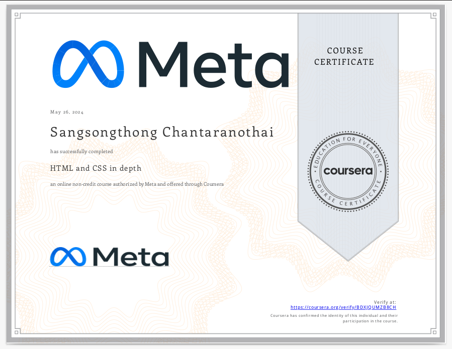

# About Me Professional

I'm Sangsongthong Chantaranothai.

***Penetration Tester | UI/UX Designer | Digital Marketer | Founder & Owner of the Hexterika brand identity and its company Hexterika-Breaks-Free***

## Summary

I'm a self-taught and self-driven professional with a multidisciplinary background across cybersecurity (penetration testing), UI/UX design, frontend development, and social media marketing. My path hasn't been linear — it’s shaped by curiosity, adaptability, and a deep commitment to continuous learning.

In cybersecurity, I specialize in offensive security and penetration testing, supported by hands-on labs, certifications, and real-world practice. My foundation in frontend development and UI/UX design gives me an edge in understanding how applications are built and how users interact with them — a perspective that enhances both my red teaming and design capabilities. At the same time, I’ve built strong experience in social media marketing, focusing on content strategy, campaign management, and performance tracking.

What ties it all together is the ability to see digital systems from multiple angles — as a user, a designer, a marketer, and a security tester. This broad but interconnected skill set helps me approach complex problems with both creativity and precision.

To organize and represent these diverse skills, I created Hexterika — not just a brand, but a personal platform to showcase my journey, projects, and service offerings across these fields.

## Brief Overview

On this page, you will find that my skills are groups in order as follow to showcase my skills and background in the most detail and accurated way in one single page.

| Section Name | Description |
| :----------: | :---------: |
| Cybersecurity | A detailed overview of my penetration testing and cybersecurity training, tools, and hands-on experience. |
| Frontend Development & Coding | Acts as a bridge between cybersecurity and creative design — supporting both secure coding and layout understanding. |
| UI/UX Design | A standalone skillset focused on user interface and experience design using Figma, independent of coding. |
| Social Media Marketing | Focused on digital strategy, content creation, and campaign management. |
| Soft Skills, Non-tech field, and Languages| Transferable interpersonal skills and multilingual ability. |
| Formal Educational Background | Formal Education background. The specific sections above are all self-taught. |
| Contact Me | Direct ways to reach out to me for collaboration or hiring. |

## Cybersecurity Focus

I'm a passionate and dedicated Jr Penetration Tester with a strong interest in offensive cybersecurity. My journey in cybersecurity began in early 2023, and since then, I've been building up my skills and credentials through hands-on labs, certifications, and practical projects.

My primary focus is in penetration testing and offensive security. I began my cybersecurity path by earning the following certifications:

### Certificates

🔐 [CompTIA Security+ ce (Nov 2024)](https://www.credly.com/badges/b856b0d7-bb20-466c-8981-b7744f8bb64f/public_url)

🛡️ [ISC2 Certified in Cybersecurity (CC) (March 2023)](https://www.credly.com/badges/2219a41c-2094-41a5-a530-28cf093c2c29/public_url)

🧠 TryHackMe Jr Penetration Tester Learning Path - Certificate of Completion (Feb 2023)
  

I've also explored front-end web development to strengthen my understanding of web application security. Although I initially shifted to web development (HTML, CSS, JavaScript), I quickly realized how foundational knowledge in web apps enhances my penetration testing approach.

I've completed several cybersecurity projects and hands-on labs on platforms like TryHackMe, Hack The Box, PortSwigger Web Security Academy, and by building virtual home labs. These experiences have enhanced my understanding of real-world attack techniques, vulnerability exploitation, and report writing. I consistently sharpen my skills through Capture The Flag (CTF) challenges and technical write-ups.

### My Projects

+ [TryHackMe-Walkthroughs](https://github.com/sangsongthong-hexterika/TryHackMe-Walkthroughs)

+ [MockPenetrationTestingReport](https://github.com/sangsongthong-hexterika/MockPenetrationTestingReport)

+ [IT-Cybersecurity-Oneshots](https://github.com/sangsongthong-hexterika/IT-Cybersecurity-OneShots)

+ [PortSwiggerWalkthroughs](https://github.com/sangsongthong-hexterika/PortSwiggerWalkthroughs/tree/main)

+ [AD-VirtualHomeLab1](https://github.com/sangsongthong-hexterika/AD-VirtualHomeLab1)

+ [Bug Bounty Report Template](https://github.com/sangsongthong-hexterika/BugBountyHunting)

+ [Bugcrowd Profile](https://bugcrowd.com/hexterika-cyberlab)

### Penetration Testing Specializations

+ Web Application
+ Active Directory
+ Internal Network Penetration Testing

### Tools & Technologies

+ **Penetration Testing:** Kali Linux, Burp Suite, Metasploit

+ **Network Analysis:** Nmap, Wireshark, BloodHound

+ **SIEM:** Splunk, ELK Stack

+ **Scripting:** Python & Bash

+ **Documentation:** GitHub

## Social Media Marketing

Alongside my technical expertise, I am also building a career in Social Media Marketing, particularly in campaign management, content creation, and performance tracking. I’ve earned the Meta Social Media Marketing Certificate (May 2024):

[Meta Certified Digital Marketing Associate](https://www.credly.com/badges/1fe61a15-902c-46c8-870f-824abf9474a5/public_url)

I manage the social media accounts for Hexterika Cyberlab and Hexterika Designer on both Facebook and Instagram. Here are the accounts I am currently growing:

[Hexterika Cyberlab Facebook Page](https://www.facebook.com/share/165WozGYNW/)

[Hexterika Cyberlab Instagram](https://www.instagram.com/hexterika.cyberlab?igsh=cTRoaGxmNGxrcmMz)

[Hexterika Designer Facebook Page](https://www.facebook.com/share/1AYY5bVfaa/)

[Hexterika Designer Instagram](https://www.instagram.com/hexterika.designer?igsh=MW83dXM4aG92amtrNw==)

### Skills

+ Social Media Marketing on Facebook, Instagram
+ Ads Manager
+ Campaign Manager
+ A/B Testing
+ Lookalike Audience
+ Custom Audience
+ Facebook Pixel

### Key Aspects of My Work

Campaign Strategy: Developing comprehensive strategies to increase brand visibility and engagement.

Content Creation: Designing and producing engaging content tailored to target audiences.

Performance Tracking: Monitoring metrics to refine strategies and achieve campaign goals.

## Design Background

Though I initially explored front-end web development, I found that UI/UX design via Figma aligns better with my creative side. I use these design skills to create user-friendly and visually appealing content, especially for digital campaigns. This includes developing design elements like personas, user journey maps, and high-fidelity prototypes for web design, which I can adapt for social media content as well. Additionally, I leverage Canva for creating quick, shareable visuals and templates that maintain consistency across various platforms.

This is the course I learned to use Figma.

Here are my projects:

[Little Lemon Figma - Desktop High Fidelity Prototype](https://www.figma.com/proto/hFfuqzRMc54dnM0BnEA2r6/LittleLemonCapstone-Prototype?node-id=0-1&t=ZVPW87DxqlsFMsP8-1)

[Little Lemon Figma Design - Mobile High Fidelity Prototype](https://www.figma.com/proto/TcEI6RL94a7VglPy1BEivR/Prototype-TheLittleLemon?t=ZVPW87DxqlsFMsP8-1)

[Little Lemon Figma Design - Wireframe](https://www.figma.com/proto/HadK0u8rd4VIVv1s5HqFt1/LittleLemonCapstoneProject-Wireframe?t=ZVPW87DxqlsFMsP8-1)

[Klaus The Persona - Fig Jam Board](https://www.figma.com/board/rn7enwRrV5p9hk2V1Isr4p/KlausThePersona?t=ZVPW87DxqlsFMsP8-1)

[Klaus Journey Map - Fig Jam Board](https://www.figma.com/board/dgiRUo2VuLaDKvsG3obfAY/KlausJouneyMap?t=ZVPW87DxqlsFMsP8-1)

## Non-Tech Skills & Soft Skills

General Skills list:

+ CRM Tools: Zoho CRM, Salesforce CRM
  + [Salesforce Essential Training](https://www.linkedin.com/learning/certificates/e5f50eb54f6685a83b789d106897b86563e67ba659cd5ae650d3e3d7ef9e81da)
  + [Learning Zoho CRM](https://www.linkedin.com/learning/certificates/6d79d3ad29248743651a1f1439c003056ce742962d58b9a76a58b9d6e68c1387)
+ Notion
+ Google Workspace
  + Google Drive
  + Google Doc
  + Google Sheet
  + Google Spread
  + Google Form
  + Google Calendar
  + Google Maps
  + Other Google Services
+ Microsoft Office
  + Word
  + Excel
  + Power Points
+ **Time Management, Working Across Time Zones, and multi-tasking**
  + **Early Exposure to Demanding Global Schedules**
    + Enrolled in a Canadian engineering program during COVID-19, attending live classes overnight in my local time zone.
    + Although I was committed, the combination of poor time management and financial constraints made it challenging to sustain the program. Ultimately, I chose to step back and reassess my path, realizing the need for better balance between work, study, and personal life.
    + As a result of this reassessment, I formally left the engineering program and began working at the Synchrotron Light Research Institute—marking a clear pivot toward hands-on, practical work and a new professional direction.
  + **Developed Time Management Through Diverse Roles**
    + While enrolled, I also worked part-time as a freelance tech support, assisting a senator with her online conference and enabling smooth remote work.
    + This role involved both onsite and remote responsibilities and marked my early experience in multitasking, time management, and coordinating tasks that depended on global time considerations.
    + Learned to juggle overlapping responsibilities—technical support, client coordination, and adapting to shifting schedules—which strengthened my multitasking and prioritization skills.
  + **Practical Time Management Skills Developed Since 2022**
    + Built and refined personal systems to manage independent work, study, and project goals effectively.
    + Focused on balancing various responsibilities across different time zones (e.g., Bangkok and Romania).
  + **Timezone-Aware Planning and Scheduling**
    + Practice time zone coordination for personal projects, including scheduling and planning across regions.
    + Developed the ability to work autonomously and adjust schedules to optimize productivity.
+ ***Result:*** I bring strong, self-developed time management and cross-timezone scheduling skills, ready to manage remote work and collaboration.

## Multidisciplinary Approach

I'm blending my interests in cybersecurity, marketing, and design into a unique personal brand, Hexterika, to showcase who I am and what I can offer. I’m committed to continual learning, professional growth, and breaking free from traditional limitations.

## Education

+ **Bachelor of Sport Science**
Suranaree University of Technology, Thailand (2016-2020)

  + Self-taught Linux and Python alongside academic studies.
  + Completed a basic Arduino project for a Sport Technology course; led the group and coded the project independently within two weeks despite a delayed budget.
  + Anticipated project risks, self-learned coding in advance, and ensured timely submission.
  + Completed a 4-month COOP internship as a Personal Trainer Assistant.

+ **Skyline High School**
CO, USA – Exchange Student (2011-2012)
  + Exchange Student Program
  + Gained real-life fluency in English through full immersion in an American high school environment.
  + Developed strong soft skills including communication, cross-cultural understanding, adaptability, and problem-solving.

## Languages

+ **English** (TOEIC 2025)
  + **Writing:** C1 (January)
  + **Speaking:** B1 (February)
  + **Reading:** B1 (January)
  + **Listening:** B2 (January)
+ **Thai** (Native)
+ **French** (A0-A1)
+ **Spanish** (A0-A1)
+ **Romanian** (A0-A1)

---

## Contact Me

[LinkedIn](https://www.linkedin.com/in/sangsongthong-chantaranothai/)  

[GitHub](https://github.com/sangsongthong-hexterika)  

[TryHackMe](https://tryhackme.com/r/p/gexter5thm)

[Hexterika Website](https://hexterika-breaks-free.website)

### *Sangsongthong*

---
